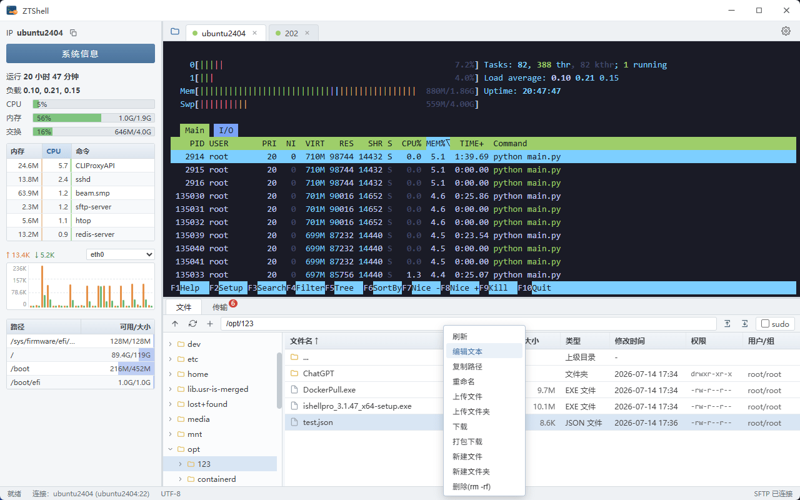

# ZTShell

基于 Tauri 2 + Vue 3 + Rust 构建的跨平台桌面端 SSH 客户端 ZTShell，布局借鉴 FinalShell 及其他同款优秀工具



## 功能

- 三栏可拉伸布局：左侧系统监控面板、右上 SSH 终端区、右下文件管理器
- **SSH 终端**：多标签会话，基于 xterm 渲染，支持密码 / 私钥认证、PTY 交互与窗口自适应
- **连接管理器**：新建 / 编辑 / 删除连接，配置持久化到本地
- **文件管理（SFTP）**：目录浏览、上传 / 下载、新建目录、重命名、删除
- **远程监控**：定时采集远端系统信息、CPU、内存、网卡、磁盘、进程占用
- 暗色主题，设置项持久化

## 技术栈

| 层 | 选型 |
| --- | --- |
| 前端 | Vue 3 + TypeScript + Vite + Pinia + splitpanes + xterm |
| 后端 | Rust + Tauri 2 + russh + russh-sftp + tokio |

## 开发

```bash
# 安装前端依赖
npm install

# 启动开发（首次会编译 Rust 依赖，耗时较长）
npm run tauri dev

# 构建发布包
npm run tauri build

# 建议使用 1024×1024 PNG 支持透明背景设置应用图标（自绘标题栏需要复制一份到 ./public/app-icon.png）
npm run tauri -- icon ./logo.png
Copy-Item .\src-tauri\icons\128x128.png .\public\app-icon.png -Force

# 修改版本号
# Tauri 应用及安装包版本：src-tauri/tauri.conf.json:4
# Rust 应用版本：src-tauri/Cargo.toml:3
# 前端项目版本：package.json:4
```

## 说明

- 监控功能依赖远端为 Linux（读取 `/proc` 及 `df` / `ps`），Windows / 其他远端暂不支持监控。
- 项目由 AI 全程开发，规范与功能文档见 `AGENTS.md` / `CLAUDE.md` 的 Prompt 节与 `.ai-assisted/markdown/`。
- 对待实现的需求感兴趣，可参考 `.ai-assisted/TODO.md` 文件
