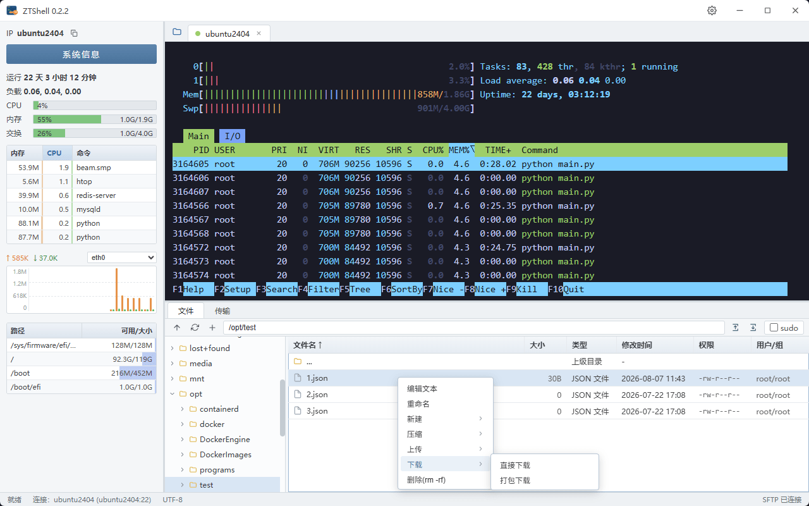
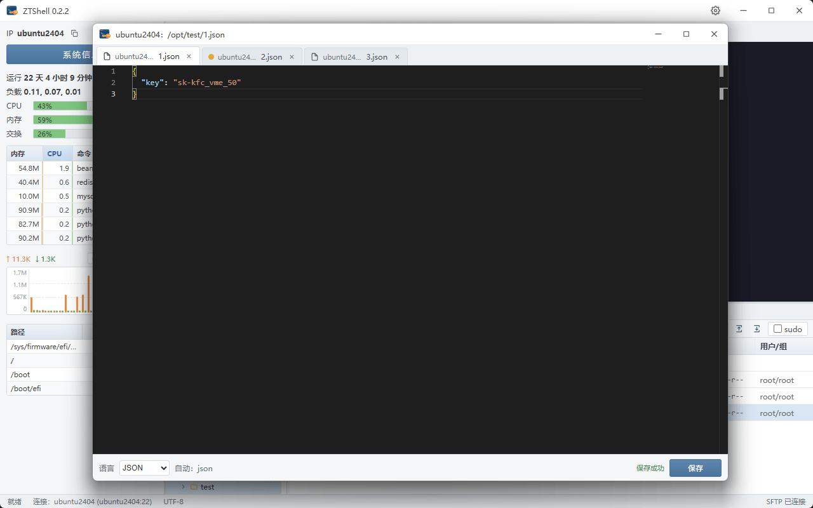
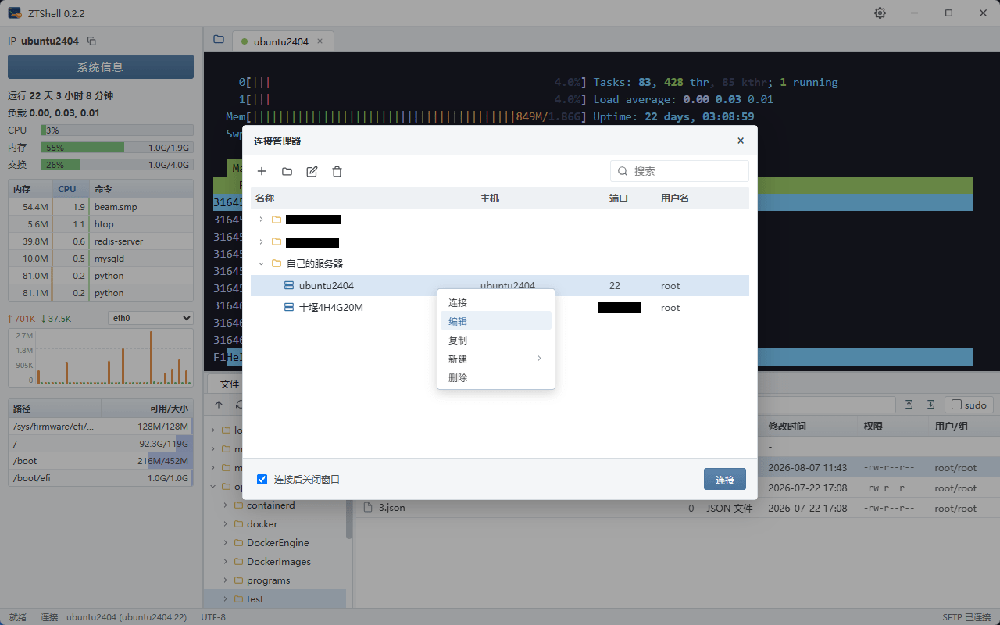
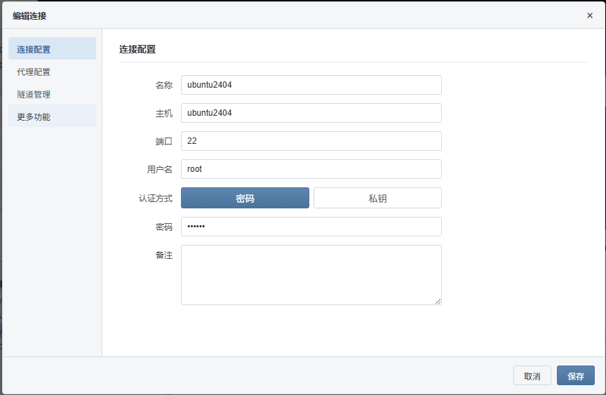
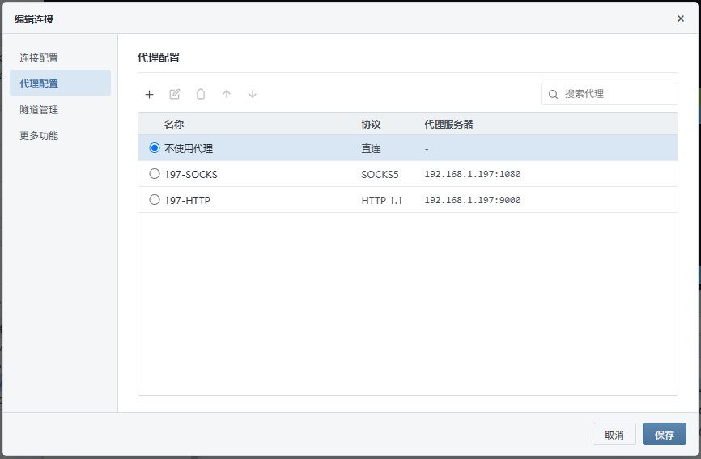
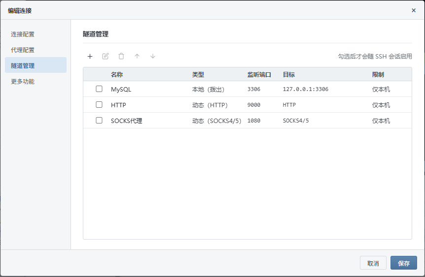

<p align="center">
  
</p>

<h1 align="center">ZTShell</h1>

<p align="center">基于 Tauri 2 与 Rust 构建的跨平台桌面 SSH 客户端。</p>

<p align="center">
  <a href="https://github.com/z-hanzhe/zt-shell/releases"></a>
  <a href="./LICENSE"></a>
  
  
  
</p>

ZTShell 将终端、多会话、远程文件管理、传输任务和 Linux 监控集中在一个可调整布局的桌面工作台中。它适合需要频繁维护服务器、传输文件或配置 SSH 代理与隧道的使用场景。界面与交互设计借鉴了 FinalShell 及其他优秀 SSH 工具，谨向其开发者致敬。



## 功能

### 会话与终端

- 多标签 SSH 会话，支持密码与私钥认证、PTY 交互、重连和终端搜索。
- 支持 SOCKS4、SOCKS4A、SOCKS5、HTTP CONNECT 代理。
- 支持本地、远程、动态 SOCKS 与动态 HTTP 隧道；会话内展示代理和隧道的启用状态。

### 文件与传输

- SFTP 文件浏览、目录树、重命名、新建、删除、压缩与解压。
- 普通与 sudo 文件管理模式，适合需要提升远端文件权限的场景。
- 后台上传、下载、打包下载、断点续传、暂停、恢复和失败重试。
- 集成 Monaco 编辑器，以独立工作区打开远端文本文件，支持语法高亮、只读检测与未保存更改提示。

### 连接与监控

- 连接管理器支持分组文件夹、搜索、排序和复制。
- 可复用代理配置，并在单个连接中管理隧道配置。
- 按会话采集远端系统信息、CPU、内存、磁盘、进程和网卡流量。

## 界面预览

### 远程文件编辑



### 连接管理器



### 连接配置

<p align="center">
  
  
  
</p>

## 快速开始

### 环境要求

- Node.js LTS
- Rust stable 与对应平台的 Tauri 系统依赖

### 本地开发

```bash
git clone https://github.com/z-hanzhe/zt-shell.git
cd zt-shell
npm ci
npm run tauri dev
```

首次启动会下载并编译 Rust 依赖。浏览器运行 `npm run dev` 只能预览界面，SSH、文件操作和窗口能力须在 `npm run tauri dev` 中验证。

### 构建安装包

```bash
npm run build
npm run tauri build
```

构建结果位于 `src-tauri/target/` 下。发布版本可从 [Releases](https://github.com/z-hanzhe/zt-shell/releases) 获取。

## 发布

推送标签后，GitHub Actions 会先校验版本号，再构建 Windows x64、macOS Intel、macOS Apple Silicon 和 Linux x64 安装包，并创建对应的 Release 草稿。

```bash
git tag vX.Y.Z
git push origin vX.Y.Z
```

发布前须保持 `package.json`、`package-lock.json`、`src-tauri/tauri.conf.json` 和 `src-tauri/Cargo.toml` 的版本一致。草稿的发布说明与附件需要人工确认后再正式发布。

## 许可证

本项目采用 [MIT License](./LICENSE) 开源。
